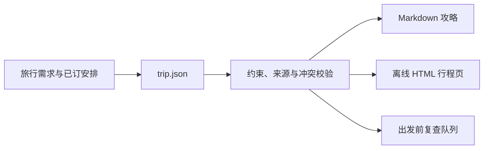

<p align="center">
  
</p>

<h1 align="center">Travel Plan Pro</h1>

<p align="center">
  <strong>把旅行愿望变成一份有证据、有余地、可复查的行程。</strong><br>
  约束先行 · 事实分层 · 同源交付 · 出发前重查
</p>

<p align="center">
  <a href="#快速开始">快速开始</a> ·
  <a href="docs/USAGE.md">使用指南</a> ·
  <a href="docs/examples/outputs/2026-10-10-example-2d_v1.html">打开离线 H5 示例</a> ·
  <a href="LICENSE">MIT 许可证</a>
</p>

---

旅行计划最怕的不是“景点不够多”，而是看似完整、实际无法执行。Travel Plan Pro 把同行人、交通、预算、预约、体力与来源状态收进同一份 `trip.json`，再生成同版本的 Markdown 攻略和可离线打开的 HTML 行程页。

它适合目的地选择、多日排程、已订安排变更与出发前复查，尤其适合带孩子、长者、预算边界或节奏要求明确的旅行。

## 为什么这份计划经得起复查

| 规划时关心什么 | Skill 如何处理 |
| --- | --- |
| 同行的人能否跟得上 | 把儿童、长者、步行上限、午休与换酒店需求作为硬约束，而不是备注。 |
| 路线是否真的排得开 | 将开放时间、交通缓冲、预约前提与首末日边界纳入每日排程。 |
| 信息是否可靠 | 区分用户陈述、已核查事实、社媒体验线索、估算、未知与冲突；未知不会被写成事实。 |
| 临近出发有变化怎么办 | 生成确定性的复查队列；修改后保存新版本，并让 Markdown、H5 与清单保持同源。 |

## 一份输入，三层交付



离线 H5 不是另一份“重新编的攻略”：它从相同的 `trip.json` 渲染，提供分区导航、按天筛选、行程骨架与本地保存的打包清单进度。

<p align="center">
  <a href="docs/examples/outputs/2026-10-10-example-2d_v1.html">查看示例离线 H5</a> ·
  <a href="docs/examples/outputs/2026-10-10-example-2d_v1.md">阅读示例 Markdown</a> ·
  <a href="docs/examples/trip.json">查看示例 trip.json</a>
</p>

> 示例使用虚构地点与来源，仅展示数据结构和交付形式，不可用于实际出行决策。

## 快速开始

1. 下载本仓库，将目录命名为 `travel-plan-pro`，放入你的项目 `.codex/skills/` 下。
2. 在 Codex 中描述旅行需求，或直接输入：

   ```text
   请使用 $travel-plan-pro，帮我规划一次旅行。
   ```

3. 开始前，Skill 会先确认是否使用 TikHub；随后才进行调研、排程、校验与同源渲染。

一个可直接使用的输入示例：

```text
从深圳出发，10 月 1 日到 4 日去厦门，2 位成人和 1 个 4 岁孩子。
预算人均 3000，优先高铁和轻松节奏，鼓浪屿必去；去返车票和酒店都还没定。
我想要离线 HTML 行程页。TikHub 本次需要接入，但先告诉我配置与预算选择。
```

更完整的安装、输入、更新与验证说明见 [使用指南](docs/USAGE.md)。具体的 Agent 工作契约见 [SKILL.md](SKILL.md)。

## 可选接口与隐私边界

核心功能只依赖 Python 标准库；高德、天气和 TikHub 都是可选增强，而不是隐性前提。

| 选择 | 能得到什么 | 需要知道的边界 |
| --- | --- | --- |
| 本次不接 TikHub | 仍可产出包含来源状态、未知项与降级说明的完整方案。 | 在地排队、亲子体验等社媒线索会更薄。 |
| 接入已有配置 | 在用户授权的请求预算内补充公开小红书体验线索。 | 体验线索不能替代开放、票价、预约、路线或天气的官方核验。 |
| 需要配置指导 | 先说明能力、费用风险和本机配置方式，不索取密钥。 | 配置与真实请求都需用户明确选择。 |

真实 TikHub 请求要求在本机安全配置 `TIKHUB_API_KEY`，并显式给出 `--budget` 与 `--usage-file`。密钥不得发送到聊天、写进 `trip.json`、HTML 或日志。Skill 不订票、不付款、不预约，也不会把未知的开放、票价、路线或余量写成事实。

## 发布与验证

在 Skill 根目录执行：

```bash
python3 scripts/release_check.py
```

该检查运行行为测试，并检查必要文件、示例、Markdown 链接、Python 3.10 语法及发布垃圾文件。GitHub Actions 还会在 macOS、Windows、Ubuntu 与 Python 3.10 / 3.13 上验证相同发布检查。

## 许可证

MIT。发布前请确认 [LICENSE](LICENSE) 中的版权主体与实际发布者一致。
